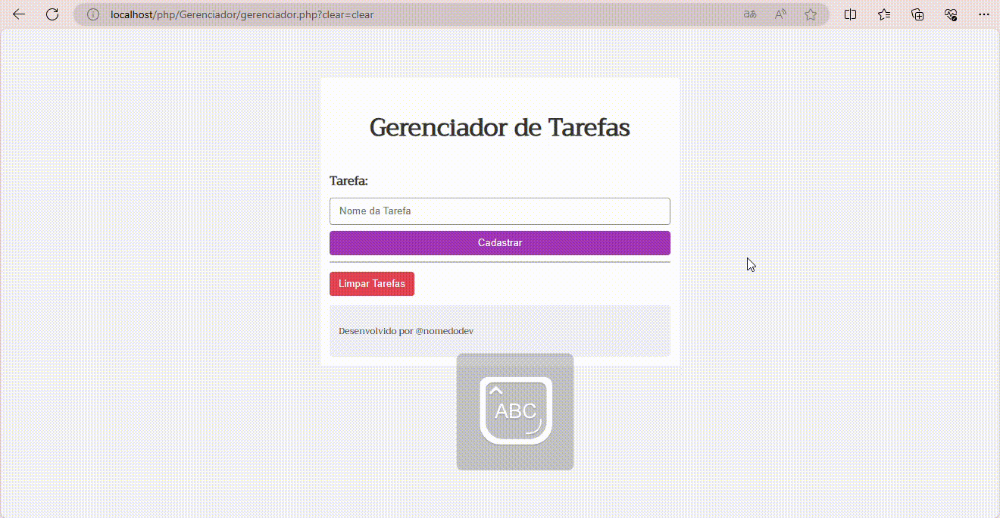

# Gerenciador de Tarefas
Esse é um projeto para te ajudar a organizar suas tarefas feito em PHP, HTML e CSS, seguindo um tutorial do canal Monolito PHP no YouTube.

O vídeo que eu usei de referencia [aqui](https://www.youtube.com/watch?v=dJ49I-QYYUk&ab_channel=MonolitoPHP).

## Recursos Utilizados

O tutorial faz uso de diversos recursos da linguagem PHP, incluindo:

### Recursos Utilizados

- **isset**: Verifica se uma variável existe.
- **$SESSION**: Guarda dados do usuário.
- **foreach**: Itera sobre elementos de uma lista.
- **session_start()**: Inicia a sessão.
- **array()**: Cria armazena valores.
- **$_GET**: guarda dados de um formulário HTML que o usuario insere.
- **array_push()**: Adiciona elementos a uma lista.
- **var_dump()**:  informações sobre uma variável.
- **unset()**: Remove uma variável.

## Funcionalidades
 O site  proporciona a ação de adicionar as tarefas do dia a dia e removelas de acordo com o cumprimento das própias, ajudando assim no dia a dia de cada um que utilizar a pagina em questão.
 

## Créditos

O código é deste tutorial do canal Monolito PHP.

# autores
 
[Ana Paula](https://github.com/anapaulacd)
 
orientador [Leonardo](https://github.com/LeonardoRochaMarista)
 
 

